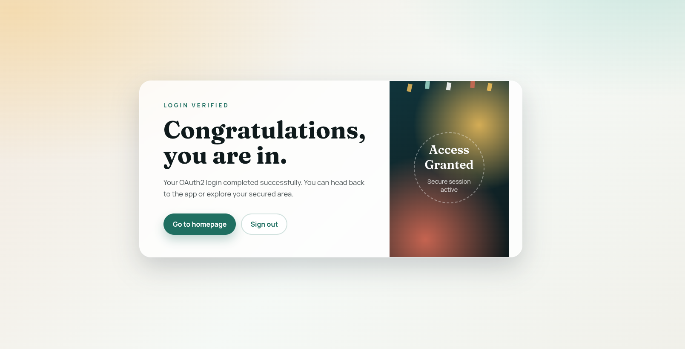

# Spring OAuth2 Login Project

This project demonstrates OAuth2 login with Google and GitHub using Spring Boot. After a successful login, users are redirected to a responsive congratulation page.



## Features

- OAuth2 login with Google and GitHub
- Spring Security protected routes
- Responsive success page after login

## Prerequisites

- Java 17 or higher (Spring Boot 3.x requires Java 17)
- Maven (or use the included `mvnw` wrapper)
- Google and GitHub OAuth2 credentials

## Required OAuth2 credentials

In order to run the application, there are Google and GitHub client and secret it required.

You must create OAuth2 credentials for both providers and set:

- Google: `client-id` and `client-secret`
- GitHub: `client-id` and `client-secret`

## Configure OAuth2

Edit `src/main/resources/application.properties` and replace the placeholders:

```properties
spring.security.oauth2.client.registration.google.client-id=YOUR_GOOGLE_CLIENT_ID
spring.security.oauth2.client.registration.google.client-secret=YOUR_GOOGLE_CLIENT_SECRET

spring.security.oauth2.client.registration.github.client-id=YOUR_GITHUB_CLIENT_ID
spring.security.oauth2.client.registration.github.client-secret=YOUR_GITHUB_CLIENT_SECRET
```

## Run the application

From the project root:

```bash
./mvnw spring-boot:run
```

The app will start at `http://localhost:8080`.

## Login URLs

- Default entry (redirects to log in): `http://localhost:8080/`
- Google login: `http://localhost:8080/oauth2/authorization/google`
- GitHub login: `http://localhost:8080/oauth2/authorization/github`

After a successful login, the app redirects to:

- Success page: `http://localhost:8080/success.html`

## Project structure

- `src/main/java/com/hassan/SpringOauth2/SecurityConfig.java` - Security configuration and login success redirect
- `src/main/java/com/hassan/SpringOauth2/HelloController.java` - Basic authenticated endpoint
- `src/main/resources/static/success.html` - Responsive success page
- `src/main/resources/application.properties` - OAuth2 client configuration

## Troubleshooting

- If the IDE asks for a JDK, set the Project SDK to Java 17.
- If login fails, verify that redirect URIs are set in your OAuth2 provider console.

## License

MIT License. See `LICENSE` for details.
